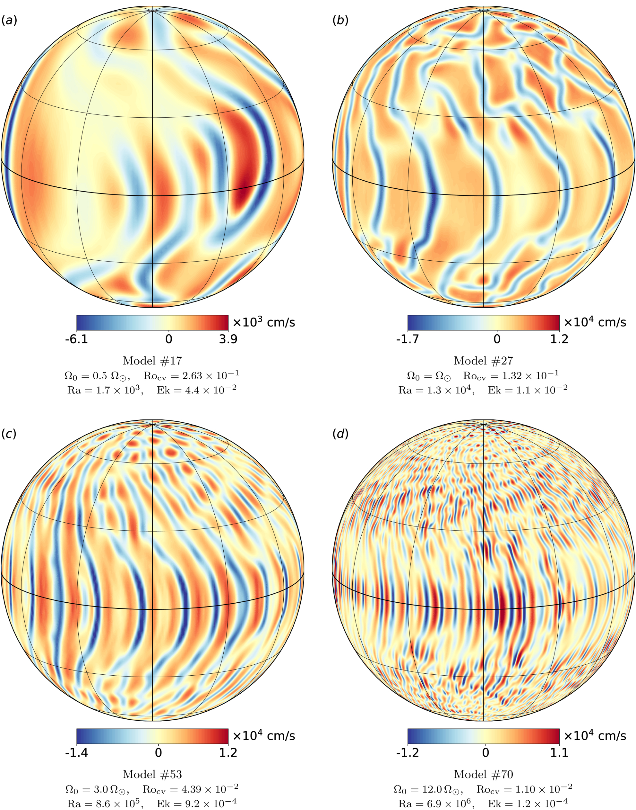
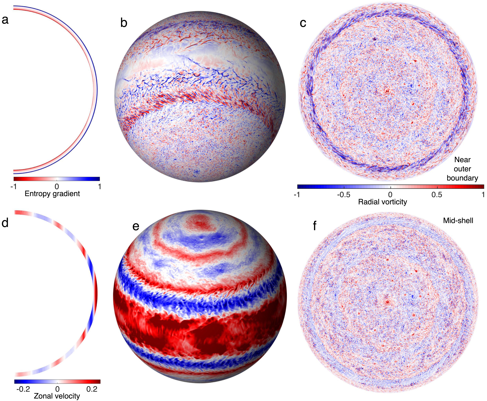
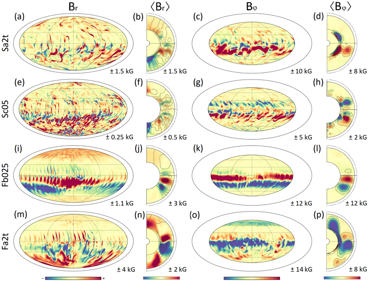
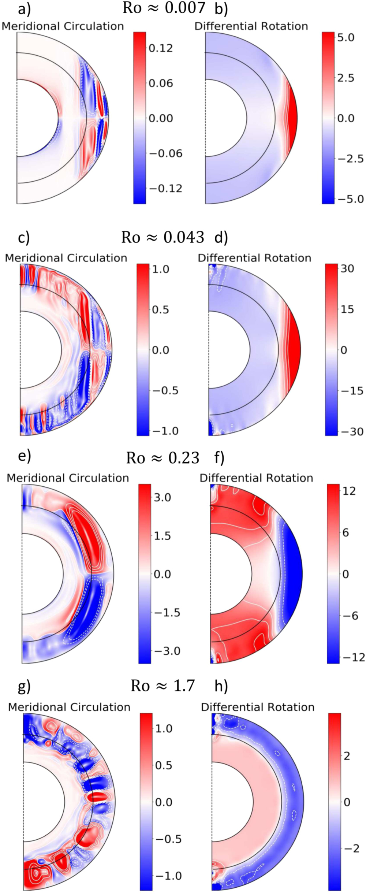

Image Gallery
=============

Radial velocity profiles near the top of shell for stellar-like convection that is sufficiently supercritical :cite:`Hindman_2020`

.. figure:: fig3_Duer_2023.jpg
    :width: 85%
    :align: center

Zonal velocity near the top near the top of the shell and midway through for convection in gas giants :cite:`Duer_2023`

Snapshots of various properties including: entropy gradient, radial vorticity, and zonal velocity for convection in gas giants for a south polar view (-30 deg lattitude) and a north polar view (top-down) :cite:`Heimpel_2022`

.. figure:: fig3_Orvedahl_2021.jpeg
    :width: 85%
    :align: center

Meridional slices of the zonal component of lorentz and coriolis forces displaying a force balance in a dynamo simulation :cite:`Orvedahl_2021`

Mollweide projection and meridional slices for both the radial and longitudinal magnetic field of a M-dwarf dynamo simulation :cite:`Bice_2023a`

Meridional slices showcasing the mass flux (meridional circulation) and the differential rotation for various rotation rates :cite:`Korre_2021`
