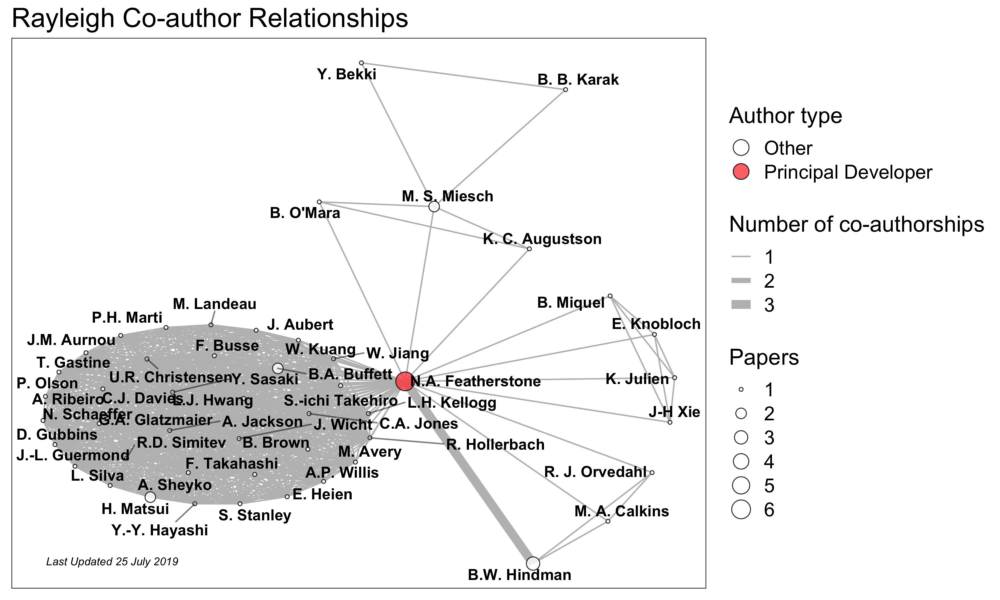

.. raw:: latex

   \clearpage

Publications
============

A list of publications using the Rayleigh code.

Software Citation
-----------------

**List:** :cite:`nicholas_featherstone_2018_1236565`, :cite:`nicholas_featherstone_2018_1158290`

.. bibliography:: software.bib

Publications by Year
--------------------
2019
^^^^
**List:** :cite:`Buffett+Matsui2019`

.. bibliography:: publications2019.bib

2018
^^^^
**List:**
:cite:`Karak_etal2018`, :cite:`Miquel_etal2018`, :cite:`Orvedahl_etal2018`

.. bibliography:: publications2018.bib

2017
^^^^
  blank

2016
^^^^
**List:** :cite:`Featherstone_Hindmam_2016`, :cite:`Matsui_etal_2016`, :cite:`OMara_etal2016`

.. bibliography:: publications2016.bib

Co-Author Network
-----------------

Network diagram illustrates the relationship between authors of the above publications.

